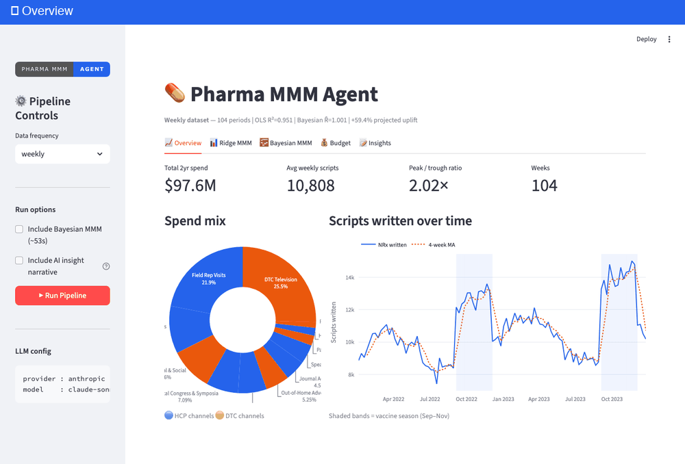

# 💊 Pharma MMM Agent — LangChain-Powered Marketing Mix Modelling for Life Sciences

> **An enterprise-grade, agentic Marketing Mix Modelling (MMM) pipeline built specifically for pharmaceutical and vaccine campaign analytics.**
> Built by a Senior Data Scientist with 6+ years of real-world pharma analytics experience at a global consultancy.



---

## 🧬 What Is This?

Most MMM tools are built for e-commerce or CPG. This one is built for **pharma**.

This template gives you a fully working **LangChain multi-agent system** that ingests vaccine / drug campaign spend data across **12 HCP and patient channels**, runs both **frequentist (Ridge/OLS)** and **Bayesian (PyMC)** MMM models across **6 US territories**, and generates **plain-English insights and budget recommendations** — the kind your commercial strategy team can actually act on.

If you've ever spent weeks wrangling claims data, fitting adstock curves, and then writing a 40-slide deck to explain what it means — this agent does that end-to-end.

---

## ⚡ What You Get

### Core modelling

| Component | Description |
|---|---|
| `tools/transforms.py` | Geometric adstock + Hill saturation transforms, wrapped as LangChain tools |
| `tools/ols_mmm_tool.py` | Ridge MMM with non-negativity constraint, prior-contribution floor, per-period attribution time series |
| `tools/bayesian_mmm_tool.py` | Bayesian MMM via PyMC — informative priors, 90% HDI per channel, MCMC convergence diagnostics |
| `tools/optimizer_tool.py` | SLSQP budget reallocation optimiser using fitted ROIs and per-channel corridors |

### Geo layer (6 US territories)

| Component | Description |
|---|---|
| `tools/geo_mmm_tool.py` | Ridge MMM per territory — in-memory transforms, prior floor, post-hoc seasonal ROI split, response curve params |
| `tools/geo_bayesian_mmm_tool.py` | Bayesian MMM per territory (PyMC) — same as national, run independently for each territory |
| `tools/geo_hierarchical_mmm_tool.py` | Hierarchical Bayesian model — single joint PyMC model with partial pooling across all 6 territories via log-normal hyperpriors; Mountain territory borrows ROI estimates from larger markets |
| `tools/geo_optimizer_tool.py` | Two-level SLSQP — Level 1: channel mix per territory; Level 2: territory budget allocation |

### Agents & insights

| Component | Description |
|---|---|
| `agents/planner_agent.py` | Orchestrator — runs the full pipeline; falls back to direct mode when no API key |
| `agents/analytics_agent.py` | LangChain agent that calls transforms → Ridge MMM → Bayesian MMM → optimiser |
| `agents/insight_agent.py` | Converts OLS + Bayesian + Hierarchical results into a pharma-grade narrative with credible intervals, national hyperprior ROI rankings, and Mountain partial-pooling corrections |
| `scripts/generate_dataset.py` | Synthetic vaccine campaign dataset generator — 12 channels, realistic pharma seasonality, 6 geo territories |

### Dashboard (7 tabs)

| Tab | Contents |
|-----|----------|
| **Overview** | KPI cards, spend mix donut, scripts time-series with vaccine season bands |
| **Ridge MMM** | Channel contributions bar chart, ROI bar chart, control variable coefficients, full results table |
| **Bayesian MMM** | Contributions with 90% HDI error bars, OLS vs Bayesian ROI scatter, control posteriors |
| **Attribution** | Per-period stacked area decomposition (baseline + channels + actual overlay), contribution waterfall |
| **Budget** | Current vs recommended overlay bar chart, reallocation table |
| **Geo** | Territory KPIs, US choropleth, channel contributions, response curves, seasonal ROI heatmap, Bayesian + Hierarchical sections, two-level optimizer, what-if simulator |
| **Insights** | Rendered Markdown narrative, download button |

---

## 🏥 Pharma-Specific Features

- **12-channel HCP + DTC split** — rep visits, medical congress, journal ads, speaker programs, samples/coupons, HCP digital, HCP email, DTC TV, DTC digital, OOH, patient email, patient advocacy
- **Vaccine seasonality** — Sep–Nov peak, summer trough, Q1 moderate; applied per-channel with calibrated strength
- **Staggered congress pulses** — rep visits pulse in Aug+Oct; medical congress in Feb+May; speaker programs 1 month post-congress — prevents artificial HCP channel collinearity
- **2-week detailing lag** — HCP contributions shifted 2 weeks in data-generating process, matching real pharma conversion dynamics
- **Competitor spend + price index** — two control variables included with informed negative priors in the Bayesian model
- **Prior-contribution floor** — for channels Ridge cannot separately identify, contributions estimated from `prior_roi` in config, clearly flagged `prior_estimate` vs `model` in all outputs
- **Seasonal ROI split** — post-hoc split of Ridge ROI into in-season / off-season using marginal efficiency ratios; surfaces saturation-driven ROI differences without adding collinear interaction features
- **Partial pooling** — hierarchical Bayesian model shares national hyperpriors across all territories; dramatically improves Mountain (small market) estimates that Ridge gets wrong
- **Attribution decomposition** — full per-period baseline + channel breakdown stored in JSON and visualised as stacked area + waterfall

---

## 🤖 Agent Architecture

```
python run.py [--bayesian] [--geo] [--geo-bayesian] [--geo-hierarchical] [--geo-insights] [--no-insights] [--freq monthly]
    │
    ▼
┌──────────────────────────────────────────────────────────────┐
│                       Planner Agent                          │
│  Orchestrates pipeline; falls back to direct mode (no LLM)  │
└────────────┬─────────────────────────────────────────────────┘
             │
    ┌────────┴──────────┐
    ▼                   ▼
┌──────────────────┐  ┌──────────────────────────────────────┐
│  Analytics Agent │  │           Insight Agent              │
│  (LLM / direct)  │  │  Reads OLS + Bayesian + Hierarchical │
│                  │  │  Writes pharma narrative (national +  │
│  1. Transforms   │  │  geo territory deep-dives)            │
│  2. Ridge MMM    │  └──────────────────────────────────────┘
│  3. Optimizer    │
│  4. Bayesian MMM │
└──────────────────┘
         │
         ▼
    LangChain Tools
    ├── apply_all_transforms_tool
    ├── run_ols_mmm_tool               → *_ols_results.json (+ attribution timeseries)
    ├── run_budget_optimizer_tool      → *_budget_optimized.json
    ├── run_bayesian_mmm_tool          → *_bayesian_results.json
    ├── run_geo_ols_mmm_tool           → *_geo_ols_results.json (+ seasonal ROI split)
    ├── run_geo_budget_optimizer_tool  → *_geo_budget_optimized.json
    ├── run_geo_bayesian_mmm_tool      → *_geo_bayesian_results.json
    └── run_geo_hierarchical_mmm_tool  → *_geo_hierarchical_results.json
```

---

## 🚀 Quickstart

### 1. Clone and install

```bash
git clone https://github.com/Shubh-kr/pharma-mmm-agent.git
cd pharma-mmm-agent
pip install -r requirements.txt
```

### 2. Set your API key (optional)

```bash
# Anthropic (default — recommended)
ANTHROPIC_API_KEY=your-key-here
```

Without a key the pipeline runs in **direct mode** — all models fit and results are saved, but no LLM narrative is generated.

### 3. Run the pipeline

```bash
# National only — no API key needed, < 5 seconds
python run.py --no-insights

# National + geo Ridge MMM + geo optimizer
python run.py --no-insights --geo

# Add per-territory Bayesian MMM (~2 min)
python run.py --no-insights --geo-bayesian

# Add hierarchical Bayesian (~5 min)
python run.py --no-insights --geo-hierarchical

# Full run with AI narratives (needs API key)
python run.py --geo --geo-insights

# Monthly frequency
python run.py --freq monthly --no-insights --geo
```

### 4. Launch the dashboard

```bash
streamlit run app.py
```

---

## 📊 Sample Output

### Ridge MMM (national, weekly)

```
Ridge MMM Results (R²=0.951, MAPE=3.0%)
Observations: 104 weekly periods | Avg period spend: $938.6K
Channels: 5 model-identified, 7 prior-estimated

Channel                        Type  Spend $K   ROI    Contrib%  Source
-----------------------------------------------------------------------
Samples & Co-pay Coupons       hcp   $10,237   0.462   32.7%    model
Field Rep Visits               hcp   $21,414   0.532   27.5%    model
Speaker Bureau Programs        hcp    $4,139   0.630   12.9%    model
DTC Television                 dtc   $24,846   0.280   10.2%    model
Medical Congress & Symposia    hcp    $6,925   0.728    1.7%    model
...
```

### Hierarchical Bayesian (6 territories, national hyperpriors)

```
National channel ROI consensus (pooled across all territories):
Channel                          Nat ROI   σ_terr   Heterogeneity
----------------------------------------------------------------
Medical Congress & Symposia       0.910    1.472    low — national playbook
Speaker Bureau Programs           0.787    1.587    moderate
Field Rep Visits                  0.665    2.414    HIGH — territory-specific needed
Patient Advocacy Partnerships     0.613    1.442    low — national playbook
...

Mountain — Ridge vs Hierarchical ROI (partial-pooling benefit):
  Patient Advocacy     Ridge=0.210  Hier=0.613  Δ=+0.403
  HCP Digital          Ridge=0.168  Hier=0.490  Δ=+0.322
  Samples & Coupons    Ridge=0.198  Hier=0.578  Δ=+0.380
```

### Seasonal ROI split (geo, weekly)

```
Channel                   Territory   In-season ROI  Off-season   Lift %
------------------------------------------------------------------------
Field Rep Visits          Northeast      0.444          0.561     -20.9%
Medical Congress          Northeast      0.777          0.712      +9.1%
Samples & Coupons         Pacific        0.421          0.476     -11.5%
```

---

## 🗂️ Dataset Schema

### Weekly national (`data/raw/mmm_weekly.csv`) — 104 rows × 24 cols

| Column | Type | Description |
|---|---|---|
| `date` | date | Week start (Monday) |
| `rep_visits` … `patient_advocacy` | float ($K) | 12 brand channel spend columns |
| `competitor_spend` | float ($K) | Competing vaccine brand spend |
| `price_index` | float (100=base) | Co-pay/price index |
| `scripts_written` | int | Vaccine prescriptions written — outcome KPI |
| `vaccine_season` | binary | 1 = Sep/Oct/Nov |
| `congress_week` | binary | 1 = congress month |

### Geo (`data/raw/mmm_weekly_geo.csv`) — 624 rows × 26 cols

Long format (104 weeks × 6 territories). Same columns plus `territory`, `territory_label`, `territory_abbr`.

### Territories

| Key | Label | Market share | HCP mult | DTC mult |
|---|---|---|---|---|
| `northeast` | Northeast | 22% | 1.20 | 1.05 |
| `southeast` | Southeast | 18% | 1.05 | 1.15 |
| `midwest` | Midwest | 20% | 1.00 | 1.00 |
| `southwest` | Southwest | 16% | 0.90 | 1.10 |
| `mountain` | Mountain | 8% | 0.85 | 0.90 |
| `pacific` | Pacific | 16% | 1.15 | 1.20 |

---

## 🧠 Modelling Approaches

### Ridge MMM (frequentist)

- Geometric adstock per channel → Hill saturation → Ridge regression (α=1.0, configurable)
- Non-negativity constraint on channel coefficients
- Prior-contribution floor for channels collinear with seasonality dummies
- Blended ROI: 60% config prior + 40% model estimate
- **Attribution time series**: per-period `baseline_timeseries` + `contribution_timeseries` per channel stored in JSON for dashboard decomposition

### Bayesian MMM (PyMC)

- `HalfNormal` priors on channel betas calibrated from `prior_roi × mean_y × 0.5`
- Informed negative priors on competitor and price controls
- 90% HDI (5th–95th percentile) on every channel
- Runtime: ~53 seconds national, ~20 min for 6 territories

### Hierarchical Bayesian MMM (PyMC)

- Single joint model across all 6 territories
- Log-normal non-centred hyperpriors on channel betas — forces positivity, handles the 3× market size range naturally
- `national_hyperpriors` block: `mu_beta_mean`, `sigma_terr_mean`, `national_roi_mean` per channel
- `sigma_terr_mean` measures territory heterogeneity — HIGH (>2) means territory-specific strategy required
- Mountain borrows strength from all other territories; corrects large under-estimates from the independent Ridge model
- Runtime: ~5 minutes; weekly R̂=1.005, monthly R̂=1.004

### Seasonal ROI Split

- Post-hoc computation using marginal efficiency ratio `(avg_sat/avg_spend)` per season
- Scales the already-blended `estimated_roi` proportionally, preserving the observation-weighted mean
- Avoids the collinearity problems of explicit interaction features

---

## 🔧 Configuration

All parameters live in `config/config.yaml`:

```yaml
llm:
  provider: anthropic        # openai | anthropic
  model: claude-sonnet-4-6

channels:
  rep_visits:
    adstock_decay: 0.60
    saturation: 0.55
    prior_roi: 0.55
    channel_type: hcp
    label: "Field Rep Visits"

ols_model:
  ridge_alpha: 1.0
  prior_contribution_weight: 0.15
  season_interactions: true      # post-hoc seasonal ROI split

bayesian_model:
  draws: 2000
  tune: 1000
  chains: 4
  geo_draws: 1000                # per-territory Bayesian
  hier_draws: 600                # hierarchical joint model
  hier_chains: 2

optimizer:
  max_spend_increase_factor: 2.5
  max_spend_decrease_factor: 0.5
  max_territory_increase_factor: 1.30   # tighter — field ops can't redeploy fast
  max_territory_decrease_factor: 0.80

territories:
  northeast:
    market_size: 4400
    spend_share: 0.22
    hcp_mult: 1.20
    dtc_mult: 1.05
    season_str: 1.05
    states: [NY, NJ, CT, MA, RI, VT, NH, ME, PA]
```

---

## 📦 Requirements

```
langchain>=0.2.0
langchain-anthropic>=0.1.0
langchain-openai>=0.1.0
pymc>=5.0.0
arviz>=0.17.0,<0.18
scipy>=1.9.0,<1.11
scikit-learn>=1.3.0
statsmodels>=0.14.0
pandas>=2.0.0
numpy>=1.24.0
plotly>=5.18.0
streamlit>=1.35.0
pyyaml>=6.0
python-dotenv>=1.0.0
```

---

## 🗺️ Phase 1 — Completed ✅

**National MMM pipeline**
- [x] Synthetic pharma dataset generator (weekly + monthly, realistic DGP)
- [x] Geometric adstock + Hill saturation transforms
- [x] Ridge MMM with non-negativity constraint and prior-contribution floor
- [x] Bayesian MMM (PyMC, MCMC, 90% HDI per channel)
- [x] SLSQP budget optimizer with per-channel corridor constraints
- [x] LLM insight narrative (Claude + GPT-4o)
- [x] Attribution decomposition: per-period stacked area + contribution waterfall

**Geo MMM pipeline (6 US territories)**
- [x] Geo dataset generator (long format, territory-scaled spend + ROI)
- [x] Geo Ridge MMM per territory with in-memory transforms
- [x] Post-hoc seasonal ROI split (in-season vs off-season marginal efficiency)
- [x] Bayesian MMM per territory (PyMC, 90% HDI, R̂ convergence)
- [x] Hierarchical Bayesian MMM — partial pooling with national hyperpriors
- [x] Two-level geo optimizer (channel mix + territory allocation)
- [x] Geo LLM narrative with hierarchical hyperprior context

**Streamlit dashboard (7 tabs)**
- [x] Overview, Ridge MMM, Bayesian MMM, Attribution, Budget, Geo, Insights
- [x] Response curves per territory (Hill saturation curves, operating-point dots)
- [x] Seasonal ROI heatmap (territory × channel diverging colorscale)
- [x] What-if geo budget simulator (6 territory sliders + preset buttons)
- [x] Hierarchical Bayesian section in Geo tab

---

## 🔭 Phase 2 — Planned

**Measurement & experimentation**
- [ ] **Incrementality testing planner** — Translate Bayesian HDI + Ridge vs Bayesian disagreement into prioritised geo holdout / lift test recommendations; identify which territory × channel has the most to gain from an experiment
- [ ] **iROAS estimator** — Geo-based lift test simulation using the hierarchical model's territory baselines as counterfactuals

**Planning tools**
- [ ] **Scenario planner** — Given a target NRx goal, work backwards to the required budget and channel mix (inverse of the optimizer)
- [ ] **Budget scenario comparison** — Side-by-side view of 2–3 named scenarios (current / optimizer / custom) with projected scripts for each; useful for budget cycle presentations

**Data & operationalisation**
- [ ] **Real data ingestion** — CSV upload flow in the dashboard; auto-detect date format, channel columns, outcome column; validation against expected schema
- [ ] **Automated refresh** — Scheduled pipeline run (weekly/monthly) that refit models and regenerates narratives when new spend data is dropped into `data/raw/`

**Output & reporting**
- [ ] **PDF / slide export** — Export the insight narrative + charts as a board-ready PDF or PowerPoint-ready slide deck
- [ ] **IQVIA / Symphony schema adapter** — Pre-built column mapping for standard pharma claims data providers

---

## 👤 About the Author

Built by **Shubham Kumar** — Senior Data Scientist at Deloitte with 6+ years building production ML systems for pharma and life sciences. This template is distilled from real-world MMM projects spanning 20M+ patient profiles, vaccine campaigns across 247 zip codes, and commercial strategy work for some of the largest pharma brands globally.

- 🔗 [LinkedIn](https://linkedin.com/in/shabam23)
- 🐙 [GitHub](https://github.com/Shubh-kr)
- 📧 shubham.mle@gmail.com

---

## 📄 Licence

MIT — use freely, modify, and build on top of this for your own projects.
If this saves you a week of work, consider leaving a ⭐ on GitHub.
